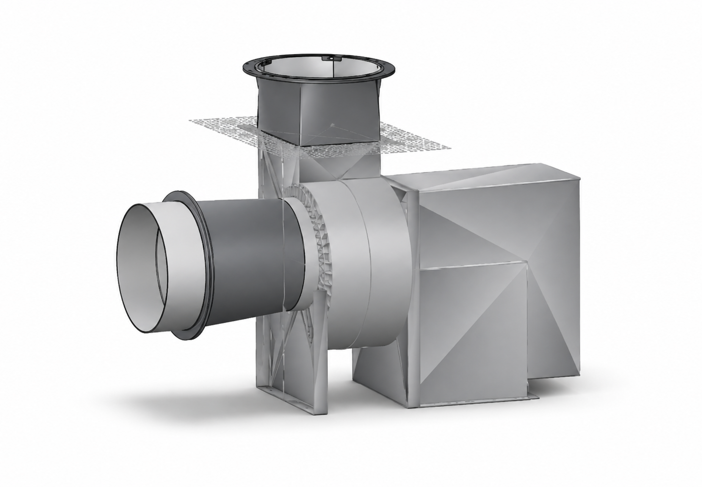
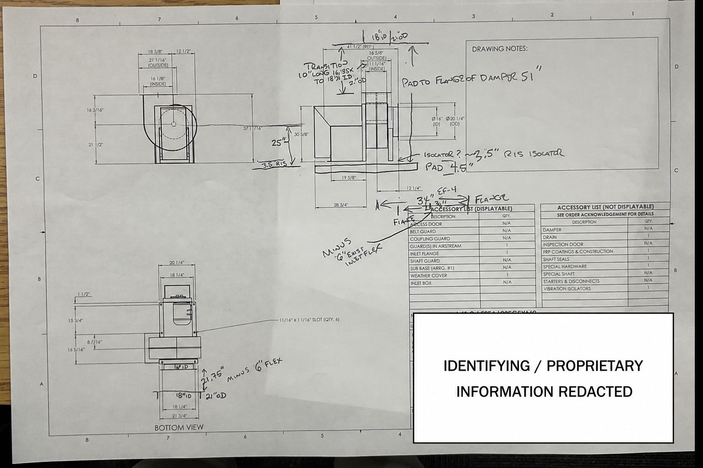
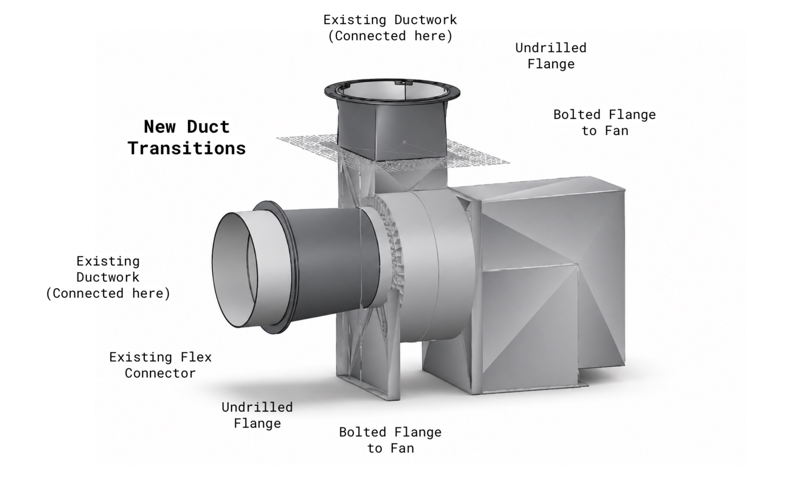

# SolidWorks HVAC Duct Transition Design

SolidWorks CAD work completed during my Summer 2026 engineering internship at Samuel Tepp Associates.

I independently designed two custom duct transition assemblies for a commercial centrifugal fan installation. The transitions were created to connect the new fan to existing ductwork while maintaining the required geometry for fabrication and installation.

## Project Overview

The project required two custom transition components:

* Square-to-round transition connecting the fan outlet to existing round ductwork
* Round-to-round transition connecting two different duct diameters at the fan inlet

The completed CAD models and supporting documentation were incorporated into the project’s customer submittal package.

## CAD Design

The models were created in SolidWorks using:

* Reference planes
* Parametric sketches
* Fully dimensioned geometry
* Equation-driven dimensions
* Lofted transitions between different duct profiles
* Custom flange geometry
* Fit checks between connecting components

The transitions were designed around the supplied fan geometry and the existing duct interfaces.

## Engineering Process

Before designing the transitions, I reviewed the project engineering drawing and verified critical dimensions against the supplied SolidWorks fan model.

I checked:

* Fan inlet and outlet dimensions
* Duct diameters and profiles
* Flange locations
* Existing flex-connector interfaces
* Overall fan geometry
* Transition clearances and alignment

The goal was to make sure the new components would interface correctly with both the fan and the existing ductwork while maintaining smooth internal transition geometry.

## Reference Drawing

The drawing below shows the type of engineering documentation used to verify dimensions and determine the required transition geometry. Identifying and proprietary information has been redacted for public display.

## Design Considerations

Key design considerations included:

* Matching the new transitions to existing ductwork
* Maintaining accurate flange placement for fabrication and installation
* Creating smooth internal geometry for airflow
* Verifying dimensions against engineering drawings
* Revising geometry based on engineering feedback
* Clearly communicating how new and existing components connect

## Final Deliverable

I produced rendered and annotated CAD documentation identifying:

* New duct transitions
* Existing ductwork
* Existing flex connector
* Bolted fan flanges
* Undrilled fabrication flanges
* Connection locations between new and existing components

The resulting documentation was used in the project’s customer-facing engineering submittal.

## Tools

* SolidWorks
* Engineering drawings / blueprint interpretation
* Parametric CAD modeling
* Lofted geometry
* Engineering documentation

⸻

Some project-specific, identifying, and proprietary information has been omitted or redacted for public portfolio use.
